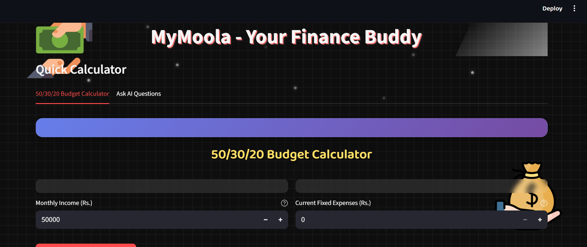
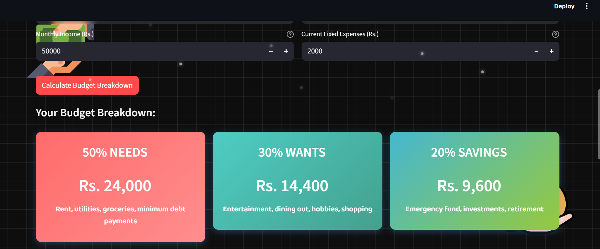
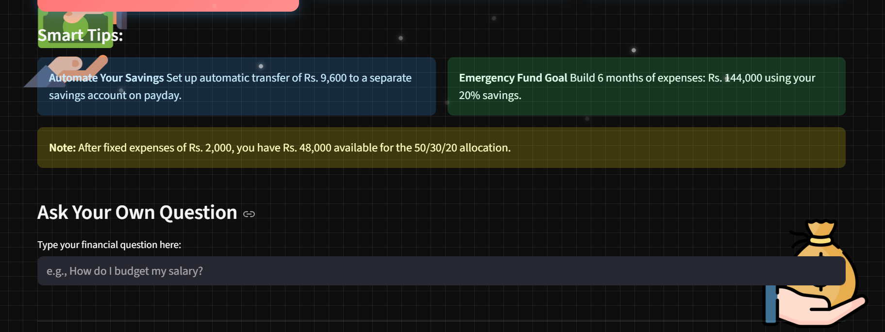

# MyMoola - AI-Powered Financial Advisor

A beautiful Streamlit app that provides personalized financial advice using AI models. Features include a 50/30/20 budget calculator, interactive chat interface, and comprehensive financial guidance.

## Preview




## Demo Video
[Watch the demo on Google Drive](https://drive.google.com/file/d/1NnzPvrfwWcAUjnsAMqMf0pfIndFBrObL/view?usp=drive_link)

## Features

- 🤖 **AI Financial Advisor** - Powered by TinyLlama/DialoGPT
- 💰 **50/30/20 Budget Calculator** - Interactive budget breakdown
- 💬 **Smart Chat Interface** - Ask any financial question
- 🎨 **Beautiful UI** - Dark theme with animations and gradients
- 📱 **Responsive Design** - Works on all devices

## Quick Setup

### 1. Clone & Navigate
```bash
git clone <your-repo-url>
cd MyMoola
```

### 2. Create Virtual Environment
```bash
python3 -m venv venv
source venv/bin/activate  # On Windows: venv\Scripts\activate
```

### 3. Install Dependencies
```bash
pip install -r requirements.txt
```

### 4. Run the App
```bash
streamlit run app.py --server.port 8501
```

### 5. Open Browser
Navigate to: `http://localhost:8501`

## What You'll See

- **Budget Calculator Tab**: Input income, get 50/30/20 breakdown
- **AI Questions Tab**: Ask financial questions, get AI-powered answers
- **Beautiful UI**: Dark theme with sparkle animations and gradient cards

## Troubleshooting

- **Model loading issues?** Click "Clear Cache" button
- **Port already in use?** Change port in the run command
- **Dependencies fail?** Try `pip install --upgrade pip` first

## Tech Stack

- **Frontend**: Streamlit + Custom CSS
- **AI Models**: TinyLlama, DialoGPT (fallback)
- **Backend**: Python + Transformers library
- **Styling**: Glassmorphism + Gradient design

## Team Notes

- First run downloads AI models (~1GB) - be patient
- Models are cached locally for faster subsequent runs
- All financial advice is educational - not professional guidance
